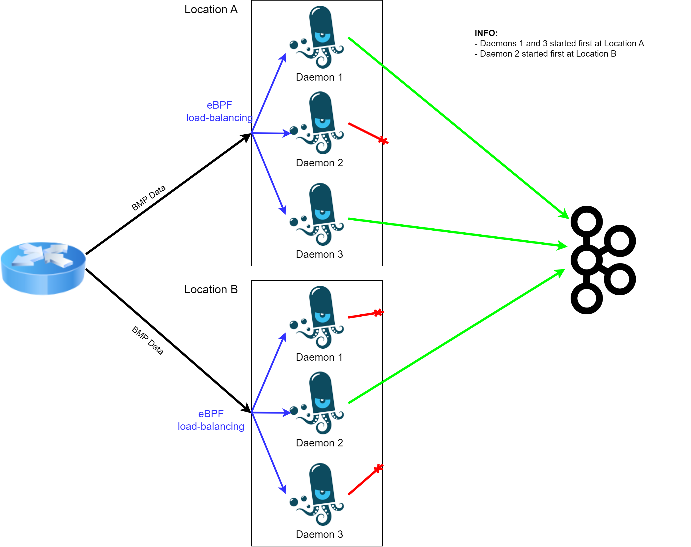

[](https://github.com/pmacct/pmacct/actions)

BMP/BGP HIGH-AVAILABILITY FEATURE DOCUMENTATION 
=============
## Important Information and Current Implementation Status

* This contribution doesn't change the behavior of the software when not enabled in the configuration file. The high-availability (HA) feature can be enabled via the following config knobs: 

**BMP Daemons:**
  ```bash
  !--------------------!
  !   Redis Settings   !                        # Required for the HA feature
  !--------------------!
  redis_host: redis-host:redis-port
  cluster_name: nfacctd_bmp_daemon_1_location_1
  cluster_id: 0
  !
  !--------------------!
  ! BMP HA Settings !
  !--------------------!
  bmp_daemon_ha: true
  bmp_daemon_ha_cluster_name: nfacctd_bmp_ha_cluster
  bmp_daemon_ha_cluster_id: 0
  bmp_daemon_ha_queue_message_timeout: 15       # Optional (default=15s)
  bmp_daemon_ha_queue_max_size: 1000000         # Optional (default=-1, i.e. unlimited)
  ```

**BGP Daemons:**
  ```bash
  !--------------------!
  !   Redis Settings   !                        # Required for the HA feature
  !--------------------!
  redis_host: redis-host:redis-port
  cluster_name: nfacctd_bmp_daemon_1_location_1
  cluster_id: 0
  !
  !--------------------!
  ! BGP HA Settings !
  !--------------------!
  bgp_daemon_ha: true
  bgp_daemon_ha_cluster_name: nfacctd_bgp_ha_cluster
  bgp_daemon_ha_cluster_id: 0
  bgp_daemon_ha_queue_message_timeout: 15       # Optional (default=15s)
  bgp_daemon_ha_queue_max_size: 1000000         # Optional (default=-1, i.e. unlimited)
  ```

* A new pair of knobs (*bm(g)p_daemon_ha_cluster_name*, *bm(g)p_daemon_ha_cluster_id*) was added specifically for this feature, as the already existing (*cluster_name*, *cluster_id*) pair was already used for the eBPF cluster, and using the same would make ha and eBPF features mutually exclusive. For more infor see the **Redis** section below.

* Compiling with --enable-redis is required for this feature

* The HA feature supports both BGP and BMP

* Regarding exporting methods, it is currently only supporting kafka with Avro

* Given vendor implementation it might be the case that the multiple BMP sessions established by a router with different collectors don't generate the exact same messages to both collectors. Thus the collector cache state might differ slightly.

## Functionality

  * While high-availability (HA) and load-balancing for IPFIX can be easily achieved at a network level by using IP anycast addresses, this is not the case for BGP and BMP, as state need to be maintained in pmacct for correlation in order to work properly. To achieve high-availability with BMP/BGP, all collectors need to receive the same BMP/BGP information from the router. The HA functionality was developed to reduce BMP/BGP duplicated messages arriving at the data collection, which would be the case in the described scenario otherwise.

  * The HA feature integrates a mechanism that specifies whether a daemon should be active (i.e. normally forwarding all received BMP/BGP messages) or stand-by (i.e. only enrich the local pmacct cache with information in the BMP/BGP packets but then dropping them instead of forwarding them).

  * The active/standby status is determined by the startup timestamp of the collector: a smaller timestamp means that a collector has worked fine for a longer time, and thus can be considered as a stable one, while the other(s), having a larger timestamp due to either being started later, or crashing while running, will be considered as less stable one(s). Please note that there can be multiple collectors where more than one collector can be standby but only one will be active (unless manually triggering forced-active or forced-standby states for a daemon, see below).

  * It is also possible to manually trigger forced active/standby states for maintenance purposes: a deamon can be triggered to be in active or standby state no matter its timestamp.

## Deployment Example (complex case with HA and eBPF load balancing)

In this example we deploy nfacctd in 2 locations (3 daemons per location), with HA enabled and eBPF load balancing (load balancing per source IP).

<p align="center">
  
</p>


When using eBPF with HA, eBPF load balancing calculation needs to be deterministic, i.e. we need to ensure to have the same number of daemons as well as the same cluster_id=bmp_daemon_ha_cluster_id in the 2 locations. This way the BMP information from the same router (source IP) is sent to the daemon with the same id in both locations. Since these daemons receive the same data it makes sense that they work in HA mode (only one of the 2 daemons is producing BMP data to kafka, see diagram above).

**Configs (only for Daemon 1):**
  ```bash
  !---------------------!                               !---------------------!
  ! Generic Settings !                                  ! Generic Settings !
  !---------------------!                               !---------------------!
  core_proc_name: nfacctd_core_loc_A                    core_proc_name: nfacctd_core_loc_B
  !                                                     !
  !--------------------!                                !--------------------!
  ! Redis Settings !                                    ! Redis Settings !  
  !--------------------!                                !--------------------!
  redis_host: redis-hostname:6379                       redis_host: redis-hostname:6379
  cluster_name: nfacctd_bmp_loc_A                       cluster_name: nfacctd_bmp_loc_B
  cluster_id: 1                                         cluster_id: 1
  !                                                     !
  !--------------------!                                !--------------------!
  ! BMP HA Settings !                                   ! BMP HA Settings !
  !--------------------!                                !--------------------!
  bmp_daemon_ha: true                                   bmp_daemon_ha: true
  bmp_daemon_ha_cluster_name: nfacctd_bmp               bmp_daemon_ha_cluster_name: nfacctd_bmp
  bmp_daemon_ha_cluster_id: 1                           bmp_daemon_ha_cluster_id: 1
  !
  ```

### Redis
  * Redis is used by each collector for cluster management, i.e. to exchange timestamp information. To quickly summarize the functionality: all daemons will periodically read the timestamp of all other daemons in the ha-cluster and compare it with their local timestamp, to decide whether they need to be in active or stand-by state. A global variable (bmp_bgp_forwarding) is then set accordingly, to tell the daemon whether BMP/BGP packets need to be forwarded (active state) or need to be dropped (stand-by state).

  * The timestamp is written to redis every 1s (PM_REDIS_DEFAULT_REFRESH_TIME) and has an expiration time of 3s (PM_REDIS_DEFAULT_EXP_TIME). If the timestamp expires, the other daemons cannot get it anymore and will assume that the daemon is offline.

  * The timestamp is written to Redis with the following key:
    ```bash
    [config.bmp_daemon_ha_cluster_name]+[config.bmp_daemon_ha_cluster_id]+[core_proc_name]+"ha_daemon_startup_time"

    e.g. nfacctd_bmp+1+nfacctd_bmp_loc_A+ha_daemon_startup_time
    (using the knobs configure in example above, location A)
    ```

  * To gather the startup timestamps of all the daemons in the cluster, we use the p_redis_get_keys() function in redis_common.c and we query redis with the following regex:
    ```bash
    KEYS [config.bmp_daemon_ha_cluster_name]+[config.bmp_daemon_ha_cluster_id]+"*"+"ha_daemon_startup_time"
    ```
    This means that the core_proc_name (defined by the homonym config knob) serves as the daemon discriminator, thus should be different between daemons in the same ha cluster (as is in the **deployment example** above).
    The query above is replied with a two dimensional array containing all keys that fit the condition (i.e. all keys of all daemons in the cluster). In order to then get the actual timestamps, we use the p_redis_get_string() function in redis_common.c.

### Queuing
  
  * In order to ensure that no BMP/BGP messages are lost in case of a failover (e.g. daemon going from stand-by to active mode, because the current active daemon has crashed), the stand-by daemon is always queuing the messages (by default for 15s, but can be configured via the *bm(g)p_daemon_ha_queue_message_timeout* config knob) before discarding them. The message expiry timeout accounts for:
    * internal state-change delays (1s redis loop and 3s redis key expiration)
    * redis command timeouts ,i.e. when tcp connection with redis goes down abruptly (3s redis command timeout)
    * router delay in sending the BMP/BGP messages to different collectors (unknown, estimate max couple of seconds)
    * network and redis querying delays (minor)

  * In case that the daemon should change to active state, all messages in the queue are immediately forwarded to Kafka. This makes sure that no BMP/BGP messages are dropped during the failover period. Keep in mind however, that some duplicate packets might arrive at the data collection in these failover situations.

  * A thread handles the discarding of messages from the queue after they've been there for more than the message expiry timeout (i.e. 10s), while another thread handles the forwarding of all the messages in the queue to the data collection as soon as the daemon becomes active.

  * The execution of the periodic table dump mechanism for BMP/BGP (which can be enabled via the bmp_dump* or bgp_table_dump* config knobs) is prevented if the daemon is stand-by. In this case however, messages are not queued. Therefore it might sometime happen that this dump is not executed, and this risk was considered acceptable.


## Sending Signals Commands
UNIX signals were integrated to give the possibility to manually trigger daemon state changes:

* **34 (SIGRTMIN)**: trigger reset of the local timestamp of the collector
* **35 (SIGRTMIN + 1)**: set collector to forced active mode
* **36 (SIGRTMIN + 2)**: set collector to forced stand-by mode
* **37 (SIGRTMIN + 3)**: set collector back to timestamp-based (i.e. non-forced) mode

### Example Scenarios:
The following scenario assumes that daemon B is operating in automatic (timestamp-based) mode and has initially a bigger timestamp than A.

| Scenario  | Daemon A's state  |  Daemon B's state  |
|-----------|:-----------------:|:-----------------------:|
|  Initial state     |  active     | stand-by |
|  Send signal 35 to A | active   | stand-by |
|  Send signal 36 to A   | stand-by  | stand-by |
|  Send signal 37 to A   | active  | stand-by |
|  Send signal 34 to A (B has smaller timestamp now)  |    stand-by       | active |
|  Redis Unavailable |  active     | active |
|  Only A's timestamp is in redis |    active       | ? |

### Example Signals:
* In order to send the signal, one has to seek for the PID of the targeted process. Let's assume that now A is active and B is passive. To search for the process ID, type:
  ```bash
  sudo ps -ef | grep "nfacctd: Core Process"
  ```

* If one now wants to set B as the active one, one needs to refresh A's timestamp. Simply type:
  ```bash
  sudo kill -34 collectorA-nfacctd-core-processID
  ```

* Now A is queuing messages while B is forwarding. If now one wants to force A to dump as well, type:
  ```bash
  sudo kill -35 collectorA-nfacctd-core-processID
  ```

* Now both A & B are forwarding. If you now want B, which is initially forwarding, to stop and queue messages, simply type:
  ```bash
  sudo kill -36 collectorB-nfacctd-core-processID
  ```

* Now A is forwarding and B is queuing messages. However, A has a lower priority and B has a higher priority due to the timestamp. If one wants to set all them back to their normal status, simply type:
  ```bash
  sudo kill -37 collectorA-nfacctd-core-processID
  sudo kill -37 collectorB-nfacctd-core-processID
  ```
  Then A will be queuing messaging while B will be forwarding, just like what is indicated by their timestamps.

### Logging:

There are two levels of logging messages for the HA functionality: 

* INFO logs: redis connectivity, daemon state changes and signal actions
* DEBUG logs: enqueuing packets, dropping packets from the queue and dumping the queue

To filter logs just pipe the following string to grep: "BMP-BGP-HA".
