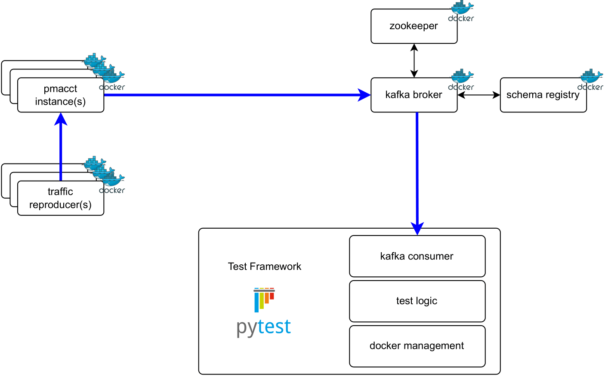

# Pmacct Test Automation Framework

This repo provides a testing framework based on pytest to perform regression testing on the [pmacct](https://github.com/pmacct/pmacct) project.

### Framework Architecture Overview

All the components (kafka stack, pmacct daemon, and traffic reproducer) are deployed as docker containers. Pytest orchestrates the setup, specific test configuration, execution, and verification logic.


<p align="center">
  
</p>

**Supported pmacct daemons:**
- nfacctd
- pmbgpd
- pmbmpd
- *sfacctd* [**coming soon...**]
- *pmtelemetryd* [**coming soon...**]

**Network Telemetry Protocols currently included in the tests:**
- IPFIX / NFv9
- BMP
- BGP
- *sFlow* [**coming soon...**]
- *YANG Push* [**coming soon...**]

## 1 - How To Install

**NOTE**: the framework depends on a functional Docker installation; to install Docker see: `https://docs.docker.com/engine/install/`. If using venv, that should also be installed, ie. on Debian/Ubuntu `apt-get install python3-venv`.

As super-user create and activate Python virtual environment:
```shell
cd test-framework
python3 -m venv venv
source ./venv/bin/activate
```

Install/Update Python project dependencies:
```shell
pip install -r requirements.txt
```

Still as super-user build single- and multi-pcap traffic reproducer image:
```shell
tools/pcap_player/build_docker_image.sh
```

Build pmacct images (checkout to desired branch or commit first):
```shell
tools/pmacct_build/build_docker_images.sh
```

**HINT**: if you already locally compiled pmacct you need to clean up the repo from the build artifacts, otherwise building the container will fail. This can be done with a `make distclean`, `git clean` and going in `src/external_libs/libcdada` and removing all content with a `rm -rf *` and `rm -rf .*`.


## 2 - How To Run

**NOTE**: minimum system requirements to run the framework are currently 4GB RAM and 10GB free disk space. Recommended is 2 CPUs, 8GB RAM and 20GB free disk space.

In order to run the tests locally you need to be in the 'test-framework' folder (which is the pytest root folder). Also, if venv is in use, you must be in the previously built venv environment.

To run one or more test cases:
```shell
sudo env PATH="$PATH" ./runtest.sh  [--dry] \
                                    [--exitfirst] \
                                    [--loglevel=<log level>] \
                                    [--mark=<expression>] \
                                    [--key=<expression>] \
                                    [<test-case number or wildcard>[:<scenario or wildcard>] ... ]

Examples:
./runtest.sh 202                              # run test 202[all scenarios]"
./runtest.sh 502:*                            # run test 502[all scenarios]"
./runtest.sh 502:00                           # run test 502[default scenario]"
./runtest.sh 103:02                           # run test 103[scenario 2]"
./runtest.sh 103:01 103:02                    # run test 103[scenarios 1 and 2]"                                      # TODO: not working
./runtest.sh 101 102 201 301                  # run tests 101, 102, 201 and 301 [all scenarios]"
./runtest.sh 101 103:02 201 301               # run tests 101, 201 and 301 [all scenarios] and test 103[scenario 02]"
./runtest.sh 1* --exitfirst                   # run all 1XX tests[all scenarios]; stop testing upon any failure"
./runtest.sh 1* --mark=ipfixv10               # run all 1XX tests[all scenarios] with IPFIX v10 data"
./runtest.sh 4*:01                            # run all 4XX tests[scenarios 1]"
./runtest.sh --loglevel=DEBUG 2*              # run all 2XX tests[all scenarios] with log level DEBUG"
./runtest.sh --loglevel=DEBUG 103 202         # run tests 103 and 202 [all scenarios] with log level DEBUG"
./runtest.sh *                                # run all test cases[all scenarios]"
./runtest.sh * --mark=ipfix                   # run all test cases[all scenarios] with IPFIX/NFv9 data"
./runtest.sh * --key=ipv6                     # run all test cases[all scenarios] with keyword \"ipv6\" in the test-name"
./runtest.sh *:00                             # run all test cases[default scenarios only]"
./runtest.sh --dry 4*                         # dry-run all 4XX tests[all scenarios]"
./runtest.sh --dry 401:01                     # dry-run test 401[scenario 1]"
./runtest.sh --dry * --key=cisco              # dry-run all tests[all scenarios] with keyword \"cisco\" in the test-name"
```

Example (run test case 300 [default scenario] with python without the ./runtest.sh wrapper):
```shell
python3 -m pytest tests/300* --runconfig=300:00 -c=pytest.ini --log-cli-level=DEBUG --log-file=results/pytestlog.log --html=results/report.html
```

A list of markers (ie. ipfix, bmp, etc.) are available to run a specific subset of tests. The full list is part of the
[pytest.ini](pytest.ini) file.

In exceptional situations, e.g. when setup or teardown fails or is stopped, there may be some remaining components left running.
To stop Kafka components, including the created network, do:
```shell
tools/stop_all.sh
```

Local folders **results/\<test case\>/\<pmacct name>/pmacct_mount** are mounted on pmacct containers' folder **/var/log/pmacct**

Local folders **results/\<test case\>/\<container name>** are mounted on traffic reproducer containers' folder **/pcap**

## 3 - Test Cases

### 1XX - IPFIX/NFv9/sFLOW
```
- 100: IPFIXv10-CISCO
- 101: NFv9-CISCO-cust_primitives
- 102: NFv9-CISCO-f2rd-pretag-sampling-reload
- 103: IPFIXv10-CISCO-pretag-JSON_encoding
- 104: IPFIXv10-IPv6-CISCO-sampling_option
- 110: IPFIXv10-NFv9-multiple-sources
- 111: IPFIXv10-NFv9-IPv6-IPv4-mix_sources
```

### 2XX - BMP
```
- 200: BMP-HUAWEI-locrib_instance
- 201: BMP-CISCO-rd_instance
- 202: BMP-CISCO-HUAWEI-multiple-sources
- 203: BMP-HUAWEI-dump
- 204: BMP-CISCO-peer_down
- 205: BMP-6wind-FRR-peer_down
- 206: BMP-high-availability
- 207: BMP-CISCO-HUAWEI-multiple-sources-dump-spreading
```

### 3XX - BGP
```
- 300: BGP-IPv6-CISCO-extNH_enc
- 301: BGP-CISCO-pretag
- 302: BGP-IPv6-multiple-sources
- 303: BGP-high-availability
- 304: BGP-IPv6-multiple-sources-dump-spreading
```

### 4XX - IPFIX/NFv9 + BMP
```
- 400: IPFIXv10-BMP-CISCO-SRv6-multiple-sources
- 401: IPFIXv10-BMP-IPv6-CISCO-MPLS-multiple-sources
- 402: IPFIXv10-BMP-IPv6-high-availability
```

### 5XX - IPFIX/NFv9 + BGP
```
- 500: IPFIXv10-BGP-CISCO-SRv6
- 501: IPFIXv10-BGP-IPv6-CISCO-MPLS
- 502: IPFIXv10-BGP-IPv6-CISCO-SRv6-lcomms
```

### 9XX - Miscellaneous
```
- 900: kafka-connection-loss
- 901: redis-connection-loss
```

## 4 - Developing Test Cases

In general, refer to the existing test cases as an example on how to develop additional ones.
Here are some useful guidelines to keep in mind when developing new test cases. 

For a new test it is necessary to provide at least the following files:
```
- XXX_test.py                             pytest file defining test execution

- container-setup.yml                     file describing the traffic container setup

- traffic-00.pcap                         pcap file (for traffic generator)
- traffic-reproducer-00.yml               traffic replay function config file

- <pmacct-daemon>-00.conf                 daemon configuration file
- output-<type>-00.json                   desired nfacctd kafka (or log) output containing json messages (or patterns)
```

Other files can be added or might be necessary depending on the specific test.

### Test Functions

Refer to [library/py/test_helper.py](library/py/test_helper.py) as documentation for test helper functions available (KTestHelper Class). These helper functions include all the required functionalty for developing basic tests, and are mainly wrappers for functions defined in:

- [library/py/test_tools.py](library/py/test_tools.py): generic test functionaliy: wait timeouts, replace entries in json and log files, compare messages, ...
- [library/py/helpers.py](library/py/helpers.py): miscellaneous generic python helpers.
- [library/py/scripts.py](library/py/scripts.py): bash scripts wrappers, mainly for setting up and managing docker containers.

Refer to those files as well if you need more additional functionality for more complex test cases.

### Pcap File

A pcap file containing the desired telemetry packets to be reproduced to the collector needs to be provided. 

The [Traffic Reproducer Project](https://github.com/network-analytics/traffic-reproducer) project provides a feature to pre-process a pcap, which can be used to clean up for example a tcpdump capture of telemetry data from lab router. This ensures that the Network Telemetry sessions within the pcap file are complete and well formed so that they can be deterministically reproduced at every test run. Refer to the [README](https://github.com/network-analytics/traffic-reproducer#pcap-pre-processing) and [examples](https://github.com/network-analytics/traffic-reproducer/tree/master/examples/pcap_processing) in the project for usage instructions.

### Expected json output

The framework can also be used to generate the expected json output files that pmacct produces to kafka. Just keep in mind that the json output needs to be manually checked to verify that the data received is as expected.

This is possible since the framework will always provide the kafka dumps (in the [results](results) folder) for each test after execution. The only problem is that without any output-XXX.json files, the tests will fail throwing a *file_not_found* error.

As example, if we want to generate the output files for test 100 (assuming that the output-flow-00.json file is not existing yet), we cannot just run the test normally as the *read_and_compare_messages* function will throw an error.
```
def main(consumers):
    th = KTestHelper(testParams, consumers)
    assert th.spawn_traffic_container('traffic-reproducer')

    th.set_ignored_fields(['stamp_inserted', 'stamp_updated', 'timestamp_max', 'timestamp_arrival', 'timestamp_min'])
    assert th.read_and_compare_messages('daisy.flow', 'flow-00')
```

To overcome this, we can temporarily replace that function with another one specifically developed for this purpose:
```
    consumer = consumers.get_consumer_of_topic_like('daisy.flow')
    assert test_tools.read_messages_dump_only(consumers[0], testParams, wait_time=120)             # wait_time is optional (default=120s)
```

This way we can simply call:
```
./runtest 100
```
and the test will be executed omitting the output check, just consuming and dumping all messages sent to the kafka topic for the specified wait_time.

The json data can be found in the [results/100-IPFIXv10-CISCO/kafka_dumps](results/100-IPFIXv10-CISCO/kafka_dumps) folder and its content can be used to generate the output-flow-00.json file. 

### Expected log output

The framework allows for checking the logfile as well, i.e. to detect if any ERROR or WARNING messages are present or to look for specific log lines or patterns. Have a look at tests 102, 103, 203, 400, 500 for some examples.

Concretely, this works by adding in the test file something like:
```
    th.transform_log_file('log-00')
    
    # Match for patterns in a provided file
    assert th.check_file_regex_sequence_in_pmacct_log('log-00')
    
    # Match for patterns provided directly
    assert not th.check_regex_in_pmacct_log('ERROR|WARN')
```

The framework provides a helper function (*transform_log_file*) with KTestHelper class, which transforms some specific macros in regular expressions that can be directly matched with the live pmacct log output.

As an example, the following line:
```
${TIMESTAMP} INFO ( nfacctd_core/core/BMP ): [${repro_ip}] BMP peers usage: 1/600
```

will be transformed to:
```
\d{4}-\d{2}-\d{2}T\d{2}:\d{2}:\d{2}Z INFO \( nfacctd_core/core/BMP \): \[172\.21\.1\.101] BMP peers usage: 1/600
```

**List of currently supported macros:**
```
**MACRO**        **REGEX**                                         **EXAMPLE MATCH**            **COMMENTS**
TIMESTAMP        \d{4}-\d{2}-\d{2}T\d{2}:\d{2}:\d{2}Z              2024-01-22T14:36:04Z
IGNORE_REST      \.                                                (anything)                   Can only be used to ignore anything at the end of the string
RANDOM           .+                                                (anything)
retro_ip         172\.21\.1\.101                                   172.21.1.101                 Taken from traffic-reproducer-XX.yml
```

### Scenarios

Some tests such as 103 have different scenarios, i.e. multiple execution of the same test logic (pytest file and pcap file do not change), but with different pmacct configuration and possibly different expected output file.

To add different scenarios for an existing test, it's enough to create a subfolder **scenario-XX** where XX=scenario number. Then in this subfolder just place all the files (config, expected output) that need to be changed for the scenarios. It's also important to document the purpose of the new scenario in the main test's README.

The following files will be considered for a scenario:
```
- <pmacct-daemon>-XX.conf
- output-<name>-XX.json
- <map_type>.map              # not necessary to create an additional pmacct_mount folder here (will be handled by the framework)
```

All other files are specific to the test logic and cannot be changed. If you need to change the pcap or the test logic within XXX_test.py, you will need to create a new test!

## 5 - Debugging

To create the pmacct test network:
```shell
tools/start_network.sh
```

To start Kafka infrastructure (pmacct test network required):
```shell
tools/start_kafka.sh
```

To start Redis, if needed (pmacct test network required):
```shell
tools/start_redis.sh
```

To start pmacct with the EXACT configuration of a specific test case:
```shell
tools/start_pmacct_and_setup_test_case.sh <test_case_number>
e.g.
tools/start_pmacct_and_setup_test_case.sh 302
```

To play pcap file from a specific pcap folder (i.e., which contains a pcap file and a config file).
Note: the pcap folder must have been created in the corresponding results folder, 
if the start_pmacct script has been used for deploying pmacct:
```shell
tools/play_traffic.sh <full-path-to-pcap-folder> <IP address of the pcap player>
e.g.
tools/play_traffic.sh /<path>/pmacct-test-automation/results/200-BMP-HUAWEI-locrib_instance/pcap_mount_0 172.21.1.101
```
To play in detached mode:
```shell
tools/play_traffic_detached.sh <full-path-to-pcap-folder> <traffic_container_ID> <IP address of the pcap player>
e.g.
tools/play_traffic_detached.sh /<path>/pmacct-test-automation/results/200-BMP-HUAWEI-locrib_instance/pcap_mount_0 0 172.21.1.101
```

To display all available (pending) messages from a Kafka topic
(note: the actual Kafka topic name is listed in the pmacct config file in the results folder of the test case):
```shell
tools/get_pending_kafka_messages.sh <Kafka topic name> <Avro|PlainJson>
e.g.
tools/get_pending_kafka_messages.sh daisy.bmp.19f5021c Avro
```

### Hints

If no messages are received and reading times out, it is very probably that you are not using the correct consumer
object in the test. The framework creates as many consumers as the number of Kafka topics referenced in the pmacct
config file. 
The fixture consumer_setup_teardown returns the list of consumers created. The test method typically calls main with
either the consumer list, or the first consumer only- it's up to the test case author.

## 6 - Internals

### Fixtures

In [tests/conftest.py](tests/conftest.py) we define the following fixtures, i.e. functions that provide a fix baseline for initializing the tests:

**check_root_dir** makes sure pytest is run from the top level directory of the framework

**kafka_infra_setup_teardown** sets up (and tears down) kafka infrastructure

**prepare_test** creates results folder, pmacct_mount, etc. and copies all needed files there 
    edits pmacct config file with framework-specific details (IPs, ports, paths, etc.)

**pmacct_setup_teardown** sets up (and tears down) pmacct containers

**prepare_pcap** edits pcap configuration file with framework-specific IPs and hostnames
              creates traffic reproduction container folders and copies traffic pcap and reproducer conf

**consumer_setup_teardown** creates and tears down the Kafka consumers (message reader)
